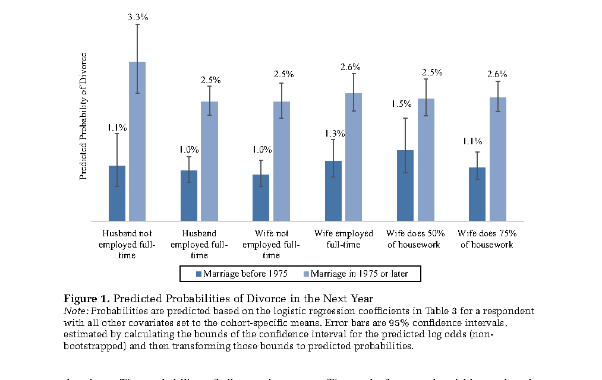

**Instructions.** Submit a single PDF rendered from a Quarto or RMarkdown source, together with the source file. This problem set is about what you will do in research: reading a published table, fitting the same kind of model on real data, and writing up what it says. No question asks for a derivation, and every computation uses the functions from Labs 3 and 4 (`glm`, `marginaleffects`, `MASS`, `pscl`, `lme4`). Where a question asks for sentences, write them as you would in a paper. You may use AI assistance, but you are responsible for understanding and being able to explain every line you submit.

Use `set.seed(723)` wherever there is randomness. The GSS extract is `Data/gss_earnings.rds`; the school data are `nlme::MathAchieve` and `nlme::MathAchSchool`, merged as in Lab 4.

\hrulefill

# Reading a Published Logit: Killewald (2016) (30 points)

Killewald, Alexandra. 2016. "Money, Work, and Marital Stability: Assessing Change in the Gendered Determinants of Divorce." *American Sociological Review* 81(4): 696--719. The article is on Sakai. Couples in the Panel Study of Income Dynamics are followed year by year; each row of the data is one couple in one year, and the outcome is whether the couple divorced in that year. Table 3 reports logits fitted separately to marriages begun in 1974 or earlier and in 1975 or later. The rows below are copied from it; the full table has about forty rows of controls.

| Variable (Table 3, excerpt) | Married 1974 or earlier | Married 1975 or later |
|:--|:--:|:--:|
| Wife employed full-time | .267 (.153), OR = 1.306 | .069 (.088), OR = 1.071 |
| Husband employed full-time | $-$.097 (.208), OR = .908 | $-$.293$^{**}$ (.106), OR = .746 |
| Wife's proportion of housework | $-$1.117$^{*}$ (.463), OR = .327 | .050 (.233), OR = 1.051 |
| Constant | $-$7.476$^{***}$ (.884) | $-$3.525$^{***}$ (.393) |
| Observations (couple-years) | 32,853 | 33,470 |

*Note:* Logit coefficients, standard errors in parentheses, odds ratios as printed in the article. $^{*}p<.05$, $^{**}p<.01$, $^{***}p<.001$. Controls include marital duration, religion, race, home ownership, children, education of both spouses, region, and marriage year.

{width=88%}

1.  **The data.** In two or three sentences: what is one row, what does the outcome equal in that row, why does a couple that stays married for twenty years contribute twenty rows, and what would be lost by collapsing the data to one row per couple with the outcome "ever divorced"?

2.  **One coefficient, three scales.** Take the husband's full-time employment in the 1975-or-later cohort, $-.293$. Write one sentence on each scale: log-odds, odds (use the printed odds ratio), and probability (use Figure 1: 2.5% when he is employed full-time, 3.3% when he is not). Then compute the odds ratio implied by those two probabilities and compare it with the printed .746. Explain in one or two sentences why they agree so closely here, using the note under Figure 1 about how the probabilities were computed.

3.  **A coefficient that is not significant.** The wife's full-time employment in the later cohort is $.069$ with standard error $.088$; Figure 1 shows 2.5% against 2.6%. Write the sentence that belongs in a results section. Then look at the same variable in the earlier cohort, $.267$ with standard error $.153$, and Figure 1's 1.0% against 1.3%. Killewald writes that the association "declined" across cohorts but that the change is not statistically significant. In two sentences, say what evidence supports each half of that claim.

4.  **Units matter.** The wife's proportion of housework runs from 0 to 1, and its coefficient in the earlier cohort is $-1.117$, printed odds ratio .327. What change in housework does that odds ratio describe? Compute the odds ratio for the change Figure 1 actually plots, from 50% to 75% of the housework, and check it against the figure's 1.5% and 1.1%. One sentence: why is a coefficient's size meaningless until you know the units of its variable?

5.  **Why a figure of probabilities.** Killewald puts predicted probabilities in Figure 1 and in the abstract, and leaves the coefficients in Table 3. In three or four sentences: what does the constant $-3.525$ give you if you convert it to a probability, for whom is that probability, and why is Figure 1's "otherwise typical couple" a better anchor? Finally, Figure 1 holds every other covariate at its cohort mean. What would the observed-value approach from lecture do instead, and would you expect the numbers to change much when the probabilities are this small?

# Your Own Logit, Reported Like a Paper (25 points)

Fit the logit from lecture on the GSS extract:

```{r}
#| eval: false
m1 <- glm(ba ~ pareduc + wordsum + female + black, data = gss, family = binomial)
```

1.  Report the coefficient table with odds ratios added, in the format of Killewald's Table 3. Interpret the `wordsum` coefficient on all three scales, one sentence each, and say why the probability sentence needs a baseline that the other two do not.

2.  **Your own Figure 1.** With `avg_predictions`, compute the average predicted probability of a degree when everyone's parents have 8, 12, 16, and 20 years of education, with 95% intervals, and plot the four bars with error bars in the style of Killewald's figure. Two sentences: why is the gain from 12 to 16 years not the same as the gain from 16 to 20, even though the coefficient is one number?

3.  **An interaction, read correctly.** Does parents' education matter more for women? Fit `ba ~ pareduc * female + wordsum + black`. Report the product coefficient with its $z$, then the AME of `pareduc` separately for men and women and the difference with its standard error. Answer the question in a short paragraph and say why the product coefficient alone could not have answered it.

4.  **A block of controls.** Add the region dummies (`region`) to `m1`. Report the likelihood-ratio test, AIC, and BIC for the two models. In a short paragraph, say what each is measuring, why with $n = 3{,}509$ the LR test rejects almost any block, and which model you would report and why.

5.  **The results paragraph.** Write the paragraph (120 to 180 words) that would appear in the Results section of a paper reporting this model. Use predicted probabilities or AMEs, not odds ratios; give the reader magnitudes and uncertainty; do not mention the log-odds scale.

# Counts (20 points)

Fit the Poisson regression for the number of children:

```{r}
#| eval: false
m_pois <- glm(childs ~ educ + female + black + exper + evermar, data = gss, family = poisson)
```

1.  Interpret $e^{\hat\beta}$ for `educ` and for `evermar`, one sentence each, in the form you would use in a paper.

2.  **Which standard errors.** Run `AER::dispersiontest(m_pois)`. Then report the standard error of `evermar` from the Poisson fit, from a quasi-Poisson fit, and from `sandwich::vcovHC`. Two sentences: what does the test say about the Poisson's variance assumption, and which standard error would you report as your default and why?

3.  **Zeros, and a model with two parts.** Report the observed share of childless respondents and the share the Poisson predicts (average `dpois(0, fitted(m_pois))`). Fit the hurdle model with `pscl::hurdle(..., dist = "poisson")` and the same covariates in both parts. Make one table with the log-likelihood, number of parameters, AIC, and BIC of the Poisson and the hurdle. Then, in a paragraph written for a reader, say what `evermar` does to the chance of *any* child, what it does to the number of children *among parents*, and what the single Poisson coefficient was averaging over.

# Observations in Groups (25 points)

Merge `nlme::MathAchieve` with `nlme::MathAchSchool` as in Lab 4: 7,185 students in 160 schools, math achievement, student SES, and school sector.

1.  **What clustering repairs.** Fit `lm(MathAch ~ SES + Sector)` and report the coefficient on `Sector` with its plain standard error and its standard error clustered on `School`. In a short paragraph, explain to a first-year student why the plain standard error is wrong for this variable, using the fact that `Sector` takes 160 values, not 7,185.

2.  **The random-intercept model.** Fit `lmer(MathAch ~ SES + Sector + (1 | School), REML = FALSE)`. Report the two coefficients with standard errors, $\hat\tau^2$, and $\hat\sigma^2$. Write one sentence for each variance saying what it measures in words, compute the intraclass correlation, and say in one sentence what that number means.

3.  **Three estimates of one slope.** Fit the fixed-effects regression `lm(MathAch ~ SES + Sector + School)`. Why is the `Sector` coefficient `NA`? Make a three-column comparison of the SES slope under pooled OLS, the random intercept, and fixed effects, and explain in a paragraph why the random-intercept slope sits between the other two: what kind of variation does each use?

4.  **Three questions, three tools.** For each research question below, say which of *OLS with clustered standard errors*, *fixed effects*, or a *random intercept* you would use, in two sentences each, naming the feature of the question that decides it.

    (a) How much of earnings inequality in a country is between workplaces rather than within them, and is that share rising?

    (b) Does a worker's wage rise after their own firm signs a union contract, using several years of data on the same workers and firms?

    (c) Does a state minimum-wage increase reduce teen employment, using data from 12 states?

\hrulefill

*Total: 100 points.*
